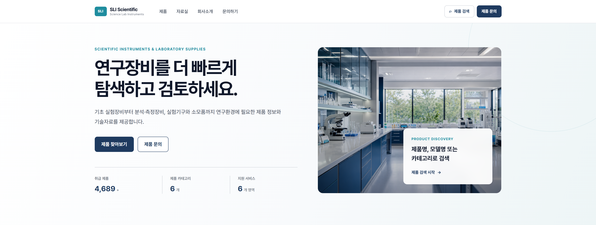
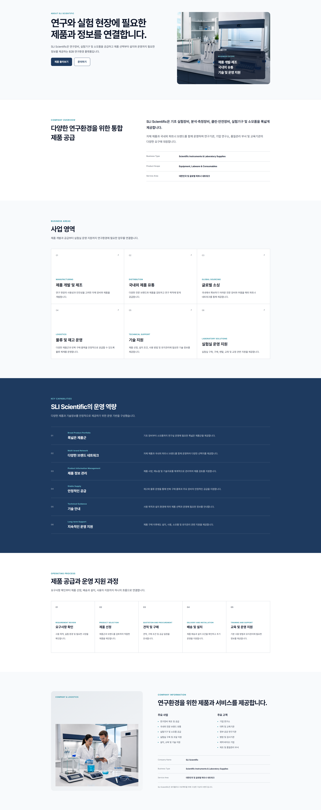
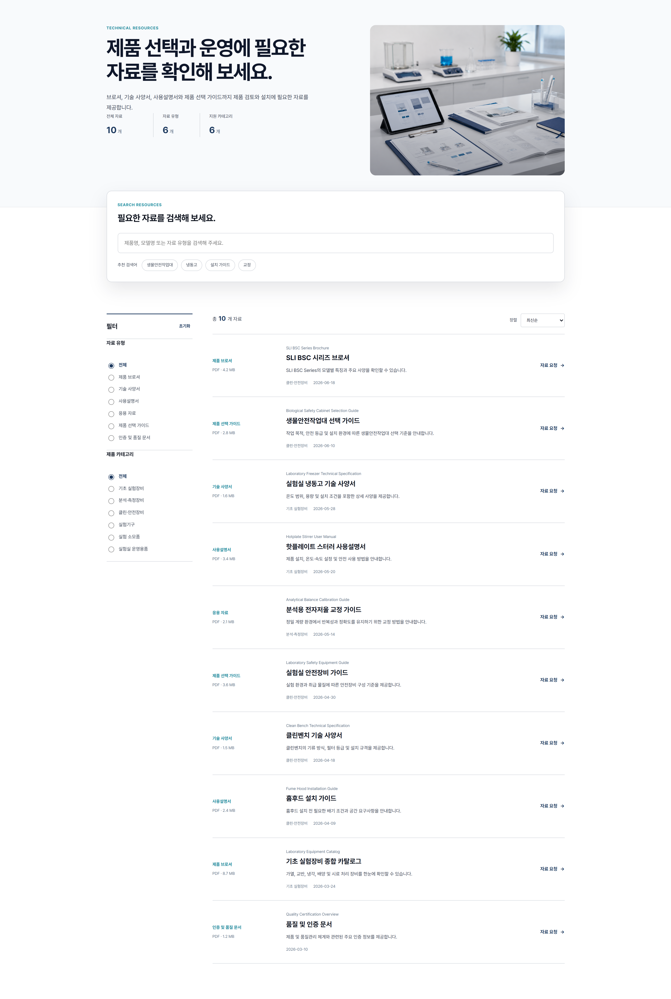
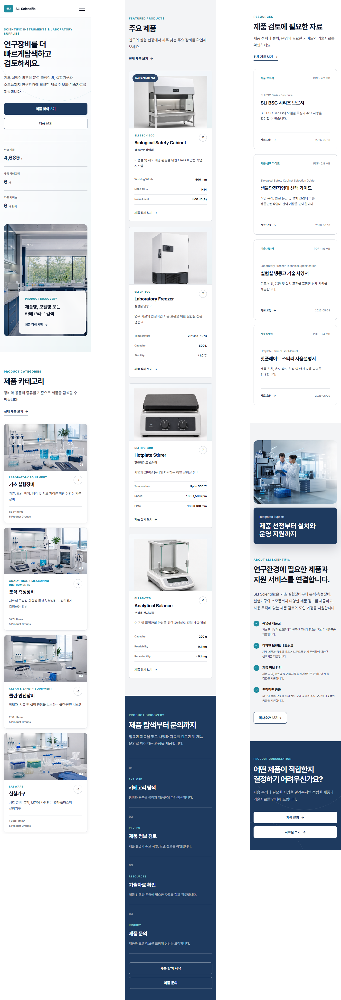

# SLI Scientific

제품 탐색과 기술 검토, 자료 요청 및 문의 흐름을 통합한
B2B 연구장비 정보 플랫폼 리디자인 프로젝트입니다.

## Live Demo

https://platform-redesign-five.vercel.app/

## Project Overview

기존 기업소개 중심 구조를 제품 탐색 중심의 정보 플랫폼으로
재구성했습니다. 사용자가 카테고리 탐색부터 제품 상세 검토,
사양 확인, 자료 요청과 문의까지 자연스럽게 이동하도록 설계했습니다.

## Problem

- 방대한 제품군에 비해 탐색 구조가 불명확함
- 제품 상세 정보와 기술 자료가 분산됨
- 문의 과정이 제품 검토 흐름과 단절됨
- 모바일 환경에서 제품 탐색이 어려움

## Solution

- 카테고리 중심 제품 탐색 구조
- 검색과 필터를 적용한 제품 목록
- 데이터 기반 제품 상세 템플릿
- 갤러리와 모델 선택 기능
- 주요 사양 비교
- 자료 요청 및 문의 페이지 연결
- 반응형 인터페이스

## Representative Product Detail

생물안전작업대를 대표 상세 사례로 선정하여 다음 경험을
심화 구현했습니다.

- 제품 이미지 갤러리
- 모델별 옵션 선택
- 주요 기능 콘텐츠
- 적용 분야
- 기술 사양 비교
- 자료 및 견적 문의 연결

## My Role

- 문제 정의 및 정보구조 설계
- UI/UX 설계
- 반응형 웹 디자인
- React 컴포넌트 구현
- 제품 데이터 구조 설계
- HTML/CSS 퍼블리싱
- 이미지 및 콘텐츠 에셋 관리

## Tech Stack

- React
- React Router
- Vite
- CSS
- Vercel

## Key Pages

- Home
- Products
- Category
- Product Detail
- Resources
- About
- Contact

## Project Structure

---text
src/
├─ assets/
├─ components/
├─ data/
├─ layout/
├─ pages/
└─ styles/

## Documentation

- [Project Brief](./project-brief.md)
- [Content & Asset Guide](./docs/content-assets.md)

## 📸 Preview

### Home Page

### Product

### Product Detail

### About

### Resources

### Responsive

---

