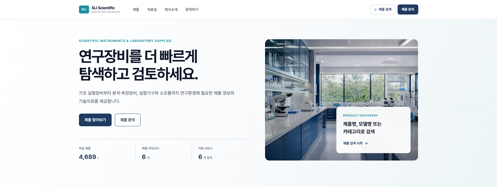
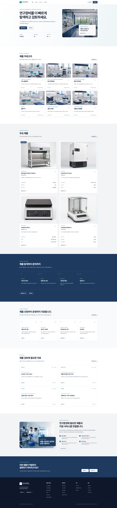
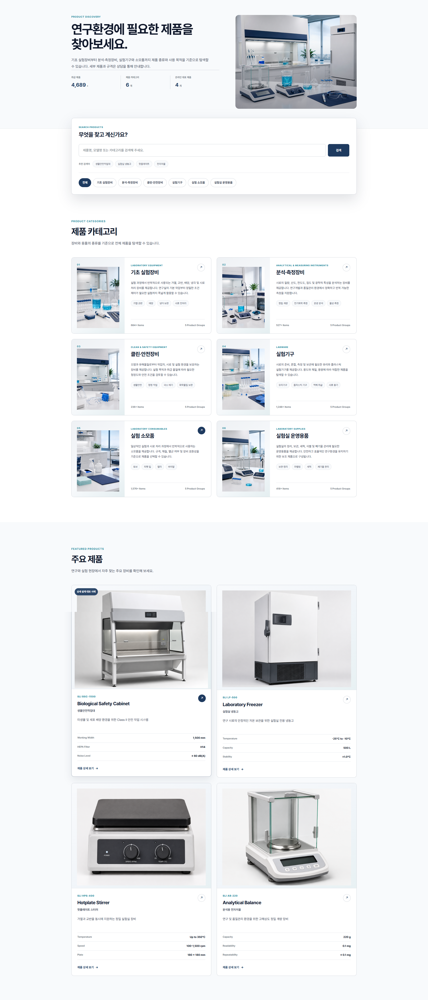
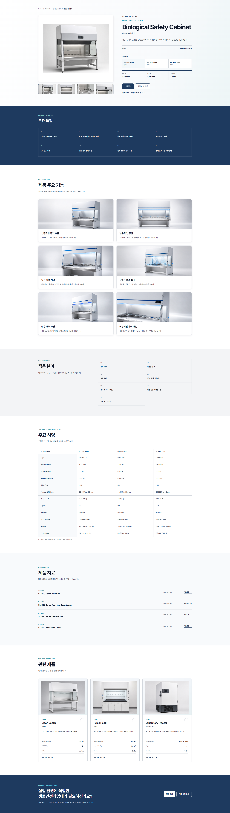
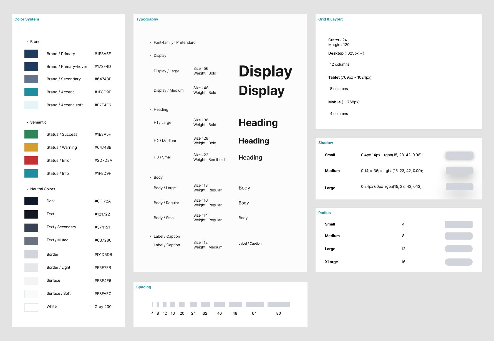
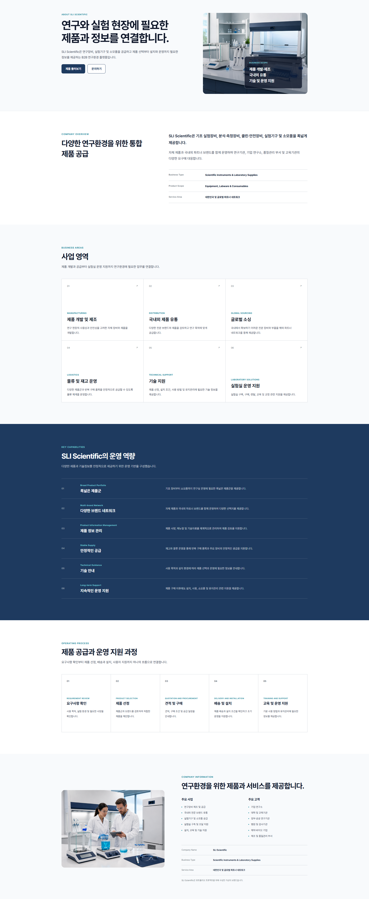
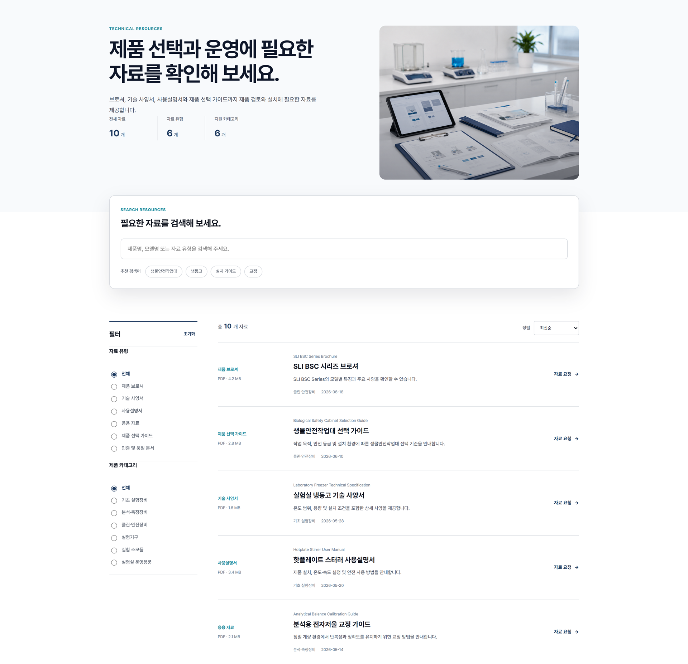
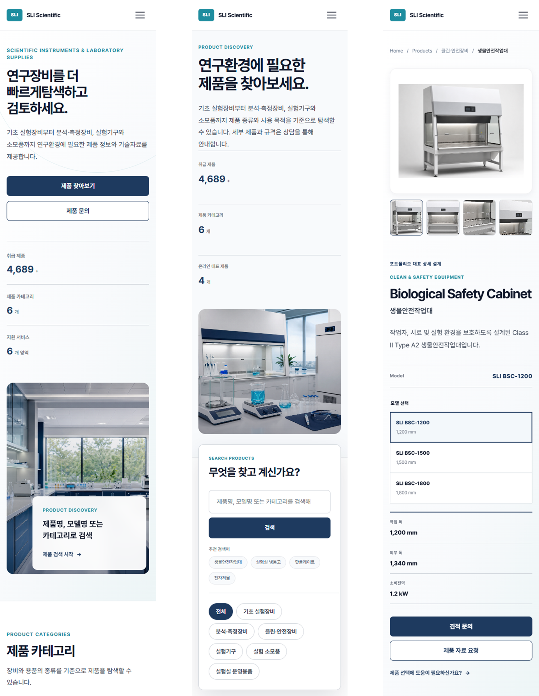

# SLI Scientific

제품 탐색과 상세 검토, 자료 확인 및 문의 흐름을 통합한
B2B 전문 제품 정보 플랫폼 리디자인 프로젝트입니다.



## Project Links

- [Live Site](https://platform-redesign-five.vercel.app/)
- [Case Study](./docs/case-study.md)
- [Project Brief](./project-brief.md)

## Project Overview

SLI Scientific은 실제 B2B 업무 환경에서 반복적으로 관찰한 정보구조와 사용자 경험 문제를
비식별화해 재구성한 제품 중심 플랫폼 리디자인 프로젝트입니다.

회사소개와 카탈로그 콘텐츠가 우선되던 구조를
제품 탐색, 상세 검토, 자료 확인과 문의 중심의 흐름으로 재설계했습니다.

React 기반 구현 환경은 AI 도구를 활용해 구성했으며,
정보구조, 사용자 흐름, UI와 반응형 기준을 설계하고
브라우저에서 결과를 반복적으로 검수·수정했습니다.

회사 식별 정보, 실제 제품 데이터와 기존 시각 자산은 사용하지 않았습니다.

## Preview

### Home Page



### Product



### Product Detail



## Problem

- 방대한 제품군에 비해 탐색 구조가 불명확함
- 제품 상세 정보와 기술 자료가 분산됨
- 문의 과정이 제품 검토 흐름과 단절됨
- 모바일 환경에서 제품 탐색이 어려움

## UX/UI Approach

- 카테고리를 중심으로 한 제품 탐색 구조
- 검색과 필터를 함께 사용하는 제품 목록
- 제품별 정보를 일관되게 전달하는 상세 페이지 구조
- 이미지 갤러리와 모델 선택 흐름
- 주요 기능, 적용 분야와 기술 사양의 단계적 구성
- 제품 검토 과정과 연결된 자료 요청 및 문의
- Desktop, Tablet, Mobile 반응형 UI

## Representative Product Detail

생물안전작업대를 대표 사례로 선정해,
사용자가 제품의 기능과 모델, 사양을 단계적으로 검토할 수 있는
상세 페이지 경험을 구체화했습니다.

- 제품 이미지 갤러리
- 모델별 옵션 선택
- 주요 기능 콘텐츠
- 적용 분야
- 기술 사양 비교
- 자료 확인 및 견적 문의 연결

## UI Foundation

Frame Design System 프로젝트에서 정리한 토큰과 컴포넌트 설계 원칙을 바탕으로,
B2B 전문 제품 플랫폼의 정보 구조와 사용 맥락에 맞는 UI Foundation을 구성했습니다.



- Deep Blue, Slate, Muted Cyan을 활용한 차분한 시각 체계
- 제품 정보의 위계를 고려한 타이포그래피와 간격 기준
- 버튼, 카드와 컨테이너의 공통 UI 원칙
- Desktop, Tablet, Mobile 반응형 기준

## Additional Screens

### About



### Resources



### Responsive



## My Role

- 프로젝트 방향과 문제 정의
- 제품 중심 정보구조 및 사용자 흐름 설계
- 주요 페이지의 UI/UX 설계
- 제품 탐색, 상세 검토와 문의 흐름 구성
- UI Foundation과 반응형 기준 정의
- 제품, 카테고리와 자료 콘텐츠 구조 정리
- HTML/CSS 퍼블리싱 및 반응형 화면 조정
- 브라우저에서 인터랙션과 화면 결과 검수
- 이미지 및 콘텐츠 에셋 관리
- GitHub 저장소 관리 및 Vercel 배포

## Implementation Environment

이 프로젝트는 다음 환경에서 구성되었습니다.

- React
- React Router
- Vite
- CSS
- GitHub
- Vercel

React 기반 페이지 구조와 동작은 AI 보조를 활용해 구성했으며,
정보구조, UI, 반응형 화면과 브라우저 결과를 중심으로 검수·수정했습니다.

## Key Pages

| Page | Purpose |
|-----|-----|
| Home | 제품 탐색의 진입점과 주요 콘텐츠 구조 제공 |
| Products | 검색과 카테고리를 활용한 제품 탐색 |
| Category | 제품군과 하위 분류를 단계적으로 탐색 |
| Product Detail | 모델, 주요 기능과 기술 사양 검토 |
| Resources | 카탈로그와 기술 자료 탐색 |
| Contact | 검토한 제품 정보가 이어지는 문의 흐름 |

## Content & UI Structure

제품과 자료가 늘어나도 일관된 탐색 경험을 유지할 수 있도록
콘텐츠 유형과 화면 구조를 공통 기준으로 정리했습니다.

- 제품, 카테고리와 자료 콘텐츠의 역할 구분
- 여러 제품에 공통으로 적용할 상세 페이지 정보 구조
- 제품 카드의 정보 위계와 반복 사용 기준
- 제품 탐색에서 상세 검토로 이어지는 페이지 연결
- 선택한 제품과 모델 정보가 문의까지 이어지는 흐름

### Product Detail Structure

```text
Product Overview
        ↓
Image Gallery
        ↓
Model Selection
        ↓
Key Features
        ↓
Applications
        ↓
Technical Specifications
        ↓
Resources and Inquiry
```
제품이 달라져도 사용자가 동일한 순서로 핵심 정보와 기술 사양을 확인할 수 있도록
공통된 상세 페이지 구조를 적용했습니다.

### Inquiry Flow

일반적인 문의 페이지로 이동한 뒤 제품 정보를 다시 입력하는 방식이 아니라,
검토 중인 제품, 카테고리와 모델 정보가 문의 화면까지 이어지도록 구성했습니다.

```text
Product Detail
        ↓
Selected Product / Model
        ↓
Contact Form
```
이를 통해 제품 검토와 문의가 서로 분리되지 않고
하나의 사용자 흐름으로 연결되도록 했습니다.

## Project Context

실제 B2B 업무에서 관찰한 문제를 비식별화해 재구성한 개인 포트폴리오 프로젝트입니다.

회사 식별 정보, 실제 제품 데이터와 기존 시각 자산은 사용하지 않았습니다.

## Additional Documentation

- [Content & Asset Guide](./docs/content-assets.md)

---


