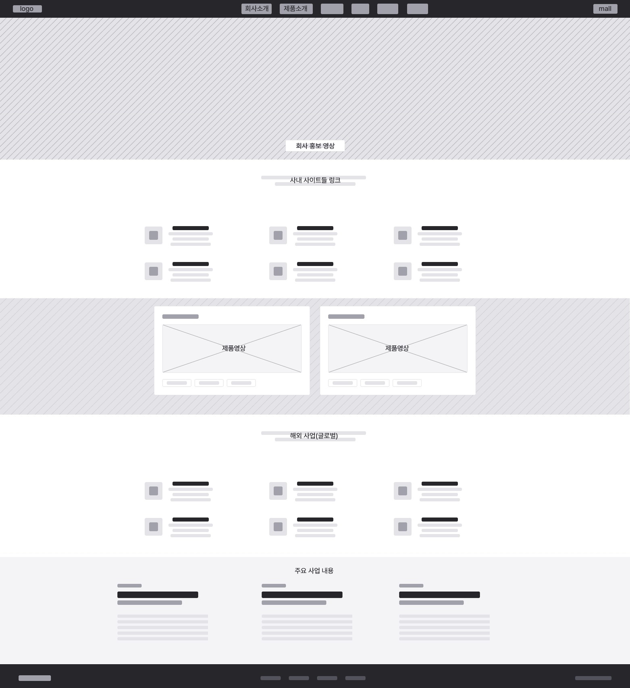
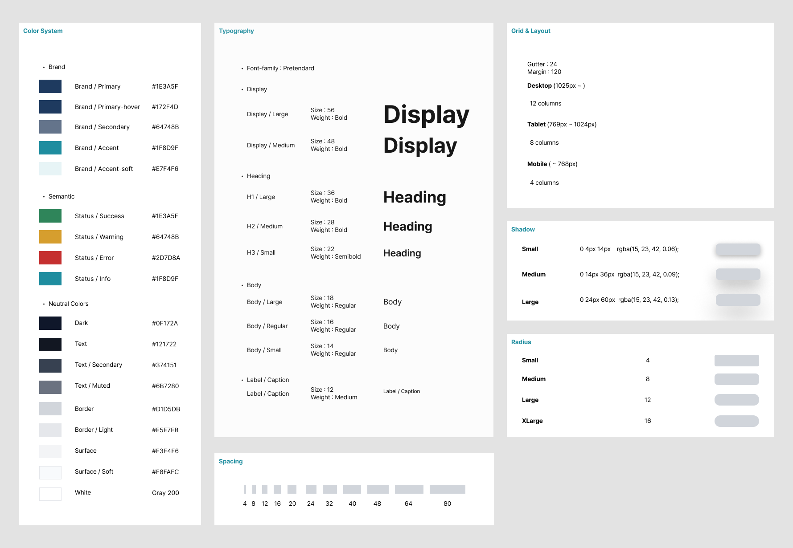

# SLI Scientific Case Study

회사소개 중심의 연구장비 홈페이지를 
제품 탐색, 기술 검토, 자료 요청과 문의 흐름 중심의 B2B 정보 플랫폼으로 재설계하고
React로 구현한 프로젝트입니다.

---

## 1. Project Overview

| 항목 | 내용 |
|---|---|
| Project | SLI Scientific |
| Type | B2B Scientific Equipment Platform Redesign |
| Role | IA, UI/UX Design, Responsive UI, React Implementation |
| Stack | React, React Router, Vite, CSS, Vercel |
| Scope | Home, Products, Category, Product Detail, Resources, About, Contact |
| Status | Responsive Web / Deployed |

### Contribution

- 프로젝트 방향과 문제 정의
- 정보구조 및 사용자 탐색 흐름 설계
- 제품 중심 페이지 구조 설계
- UI Foundation 및 반응형 규칙 정의
- React 컴포넌트와 라우팅 구현
- 제품·카테고리·자료 데이터 구조 설계
- 이미지와 콘텐츠 에셋 관리
- Vercel 배포 및 최종 QA

---

## 2. Why This Project

현재 재직 중인 B2B 과학장비 기업에서는 국내·해외 홈페이지와 쇼핑몰 등 여러 온라인 채널이 운영되고 있지만, 
사이트별 역할과 제품 정보가 분산되어 일관된 탐색 경험을 제공하기 어려웠습니다.

웹사이트에도 인쇄 카탈로그 중심의 의사결정이 강하게 적용되어,
제품 탐색과 기술 검토보다 회사 홍보 콘텐츠가 우선되는 경우가 많았습니다. 
제한된 환경에서도 반응형 대응과 기본 사용성을 유지하며 실무를 수행했지만, 
실제 작업물은 보안과 식별 문제로 포트폴리오에 공개할 수 없었습니다.

이에 현업에서 반복적으로 관찰한 정보구조와 UX 문제를 추출하고,
회사명·제품 데이터·시각 자산을 모두 비식별화해 
가상의 브랜드 SLI Scientific으로 재구성했습니다.

앞선 Minimal Shopping Mall에서 익힌 React UI 구현과
Frame Design System에서 정리한 시스템 설계 원칙을 바탕으로,
제품 탐색 중심의 B2B 플랫폼을 독립적으로 설계하고 구현했습니다.

---

## 3. Background & Problem

B2B 과학장비 웹사이트에서 사용자의 주요 목적은 회사 연혁이나 홍보 문구를 먼저 확인하는 것이 아니라, 
자신의 연구 목적과 실험 환경에 적합한 제품을 찾고 기능, 모델과 기술 사양을 검토하는 것입니다.

그러나 실제 업무 환경에서 운영되던 여러 웹사이트는 다음과 같은 구조적 문제를 가지고 있었습니다.

- 국내·해외 쇼핑몰과 홈페이지 및 기타 사이트들의 역할이 명확하게 구분되지 않음
- 사이트마다 제품 정보와 콘텐츠 구조가 일관되지 않음
- 제품 정보보다 회사 홍보와 카탈로그형 콘텐츠가 우선됨
- 방대한 제품군에 비해 카테고리와 검색 경로가 약함
- 상세 정보, 기술 자료와 문의 경로가 분리됨
- 웹사이트가 디지털 서비스보다 인쇄 카탈로그처럼 구성됨
- 사용자가 여러 사이트를 이동해야 제품 정보를 종합할 수 있음

### Core Problem

기업이 보여주고 싶은 정보가 사용자가 먼저 확인해야 하는 제품 정보보다 우선되고 있었습니다.
제품을 사이트의 중심에 배치하고, 회사소개는 제품 검토 과정에서 전문성과 신뢰를 보완하는 역할로 재정의할 필요가 있었습니다.

```text
기존 구조
회사 홍보 → 카탈로그형 콘텐츠 → 제한적인 제품 노출

개선 구조
제품 탐색 → 상세 검토 → 자료 확인 → 문의
                     ↓
              회사 신뢰 정보 보완

---

## 4. Target Users

이 플랫폼의 주요 사용자는 제품을 단순히 둘러보는 일반 소비자가 아니라,
연구 목적과 실험 환경에 맞는 장비를 검토하고 도입을 판단해야 하는 B2B 사용자입니다.

### Researcher / Lab Operator

연구 목적에 적합한 장비를 찾고, 제품의 기능과 기술 사양을 검토하는 사용자입니다.

주요 요구:

- 연구 분야에 적합한 제품군 탐색
- 제품 기능과 적용 분야 확인
- 모델별 차이와 기술 사양 검토
- 관련 자료와 브로셔 확인
- 기술 문의 또는 견적 요청

### Purchasing / Facility Manager

제품의 도입 가능성과 운영 조건을 검토하고, 구매 또는 설치 관련 정보를 확인하는 사용자입니다.

주요 요구:

- 제품군과 모델 비교
- 설치 조건과 주요 사양 확인
- 제품 자료와 인증 정보 검토
- 견적 및 납기 문의
- 기술 지원과 유지관리 범위 확인

### Shared User Need

두 사용자 유형은 담당 업무는 다르지만 다음과 같은 공통 목표를 가지고 있습니다.

```text
적합한 제품 탐색
        ↓
기능과 적용 분야 확인
        ↓
모델 및 기술 사양 검토
        ↓
자료 확인
        ↓
문의 또는 견적 요청

따라서 사이트의 정보구조는 기업이 전달하고 싶은 콘텐츠가 아니라,
사용자의 제품 검토 순서를 중심으로 설계했습니다.

---

## 5. Information Architecture

기존 구조에서는 회사소개, 홍보 콘텐츠와 제품 정보가 여러 사이트에 분산되어 있어 
사용자가 필요한 정보를 순차적으로 확인하기 어려웠습니다.

이를 개선하기 위해 제품 탐색을 중심으로 주요 콘텐츠의 역할을 재정의했습니다.

### Before: Fragmented Structure

```text

- 구조적 문제만 추상화한 비식별화 와이어프레임입니다.

Corporate Website
├─ Company Introduction
├─ History
├─ Technology
├─ Promotional Content
└─ Limited Product Information

Domestic Shopping Mall
├─ Product List
├─ Purchase-oriented Content
└─ Separate Inquiry

Global Website
├─ Company Information
├─ Export Content
└─ Different Product Structure

사이트마다 역할과 정보 구조가 달라 사용자는 제품을 검토하기 위해
여러 채널을 이동해야 했습니다.

### After: Product-Centered Platform

Home
├─ Product Categories
├─ Featured Products
├─ Product Discovery Guide
├─ Support Services
├─ Resources
├─ Company Trust
└─ Inquiry CTA

Products
├─ Search
├─ Category Filter
├─ Product List
└─ Product Card

Category
├─ Category Overview
├─ Subcategories
└─ Related Products

Product Detail
├─ Product Gallery
├─ Key Features
├─ Model Selection
├─ Applications
├─ Technical Specifications
├─ Downloads
└─ Inquiry

Resources
├─ Catalogs
├─ Technical Documents
└─ Download Information

About
├─ Company Overview
├─ Manufacturing Capability
└─ Support Scope

Contact
├─ Product Inquiry
├─ Technical Inquiry
├─ Resource Request
└─ General Inquiry

### IA Principle

정보구조는 다음 원칙을 기준으로 설계했습니다.

- 제품군을 최상위 탐색 기준으로 배치
- 검색과 카테고리 탐색을 병행할 수 있도록 구성
- 제품 상세 안에서 기능, 모델, 사양과 자료를 연결
- 제품 검토 이후 문의까지 동일한 흐름 안에서 이어지도록 설계
- 회사소개는 독립적인 홍보 영역보다 신뢰를 보완하는 정보로 배치
- 자료실을 제품 검토 과정의 지원 콘텐츠로 정의

### Primary User Flow

Home
  ↓
Product Category or Search
  ↓
Product List
  ↓
Product Detail
  ↓
Model / Specification Review
  ↓
Resource Request or Inquiry

이 흐름을 통해 사용자가 회사소개 페이지를 먼저 거치지 않고도 제품을 탐색하고 검토할 수 있도록 했습니다.

---

## 6. Product Discovery Strategy

기존 구조의 가장 큰 문제는 제품 정보가 존재하더라도 
사용자가 원하는 제품까지 도달하는 과정이 명확하지 않다는 점이었습니다.

SLI Scientific에서는 제품 탐색을 하나의 경로에만 의존하지 않고,
사용자의 탐색 방식에 따라 여러 진입점을 제공했습니다.

### Discovery Entry Points

- Home의 제품 카테고리
- 대표 제품 영역
- 제품 선택 가이드
- Products 페이지의 검색
- 카테고리 필터
- Category 페이지의 하위 제품군
- Product Card를 통한 상세 진입

사용자는 제품명을 알고 있는 경우 검색을 사용할 수 있고,
제품군만 알고 있는 경우 카테고리 탐색을 사용할 수 있습니다.

또한 어떤 제품이 필요한지 명확하지 않은 사용자는
제품 선택 가이드를 통해 탐색을 시작할 수 있도록 했습니다.

### Search and Filter

Products 페이지에서는 검색어와 카테고리 필터를 함께 사용할 수
있도록 구성했습니다.

검색 결과는 제품명, 모델과 제품 설명을 기준으로 확인할 수 있으며,
카테고리 필터를 통해 결과 범위를 줄일 수 있습니다.

```text
전체 제품
   ↓
검색 또는 카테고리 선택
   ↓
관련 제품만 표시
   ↓
제품 카드 확인
   ↓
제품 상세 진입

검색과 필터는 별도의 복잡한 기능으로 보이기보다,
사용자가 제품 후보를 빠르게 줄이는 기본 탐색 도구로 설계했습니다.


### Product Card

제품 카드는 목록 단계에서 사용자가 상세 페이지 진입 여부를 판단할 수 있도록 
다음 정보를 우선적으로 제공합니다.

- 제품 이미지
- 제품명
- 모델명
- 카테고리
- 핵심 설명
- 상세 페이지 링크

카드의 정보량을 과도하게 늘리지 않고, 
제품을 구분하는 데 필요한 핵심 정보만 제공하도록 했습니다.

### Category Page

Category 페이지는 단순한 제품 목록이 아니라, 
제품군의 구조와 하위 카테고리를 이해할 수 있는 중간 탐색 단계로 설계했습니다.

이를 통해 사용자는 전체 제품 목록에서 바로 개별 제품을 찾는 대신,
제품군의 특성을 먼저 이해하고 관련 제품을 좁혀갈 수 있습니다.

### Product Discovery Principle

제품 탐색 과정은 다음 세 가지 사용자 상태를 모두 지원하도록 했습니다.

- 제품명을 알고 있음 → Search

- 제품군을 알고 있음 → Category

- 필요한 장비가 명확하지 않음 → Product Discovery Guide

하나의 탐색 방식만 강요하지 않고, 
사용자가 현재 알고 있는 정보의 수준에 맞춰 제품을 찾을 수 있도록 구성했습니다.

---

## 7. Representative Product Detail

전체 제품에 공통으로 적용할 수 있는 상세 페이지 구조를 설계하고,
생물안전작업대를 대표 제품으로 선정해 상세 콘텐츠를 심화 구현했습니다.

대표 제품 상세는 단순한 제품 소개 페이지가 아니라, 
사용자가 제품을 검토하고 도입 여부를 판단하는 과정에 맞춰 
정보를 단계적으로 제공하도록 설계했습니다.

### Detail Information Structure

```text
Product Gallery
        ↓
Product Summary
        ↓
Model Selection
        ↓
Key Features
        ↓
Applications
        ↓
Technical Specifications
        ↓
Downloads
        ↓
Product Inquiry

- Product Gallery

제품의 외형과 주요 구조를 확인할 수 있도록 대표 이미지와 썸네일 갤러리를 구성했습니다.
썸네일을 선택하면 메인 이미지가 변경되도록 구현해, 사용자가 여러 시점의 제품 이미지를 확인할 수 있도록 했습니다.

- Model Selection

B2B 연구장비는 동일한 제품군 안에서도 크기, 사양과 모델이 달라질 수 있기 때문에 모델 선택을 상세 상단에 배치했습니다.
선택한 모델에 따라 사용자가 현재 검토 중인 제품 조건을 명확하게 인지할 수 있도록 했습니다.

- Key Features

제품의 핵심 기능을 긴 설명문보다 빠르게 파악할 수 있도록 시각적 콘텐츠와 짧은 설명으로 구성했습니다.
기능 정보는 제품의 장점을 홍보하는 데 그치지 않고, 사용자가 자신의 실험 환경에 적합한지 판단할 수 있도록
구체적인 사용 맥락과 연결했습니다.

- Applications

제품이 어떤 연구 및 실험 환경에서 활용되는지 확인할 수 있도록 적용 분야를 별도의 영역으로 구성했습니다.
기술 사양을 확인하기 전에 사용자가 제품의 활용 가능성을 이해할 수 있도록 정보 순서를 조정했습니다.

- Technical Specifications

기술 사양은 구매와 설치 검토에 필요한 핵심 정보이기 때문에 비교와 확인이 쉬운 표 구조로 제공했습니다.
제품 소개 콘텐츠와 기술 정보를 분리해, 연구자와 구매 담당자가 각자의 목적에 맞는 정보를 빠르게 찾을 수 있도록 했습니다.

- Downloads

브로셔와 기술 자료를 제품 상세 안에서 바로 확인할 수 있도록 자료 영역을 연결했습니다.
이를 통해 사용자가 제품 페이지를 벗어나 별도의 자료실에서 다시 제품을 찾아야 하는 과정을 줄였습니다.

- Inquiry Flow

제품 상세에서 문의하기를 선택하면 제품명, 카테고리와 모델 정보가 Contact 페이지로 전달되도록 구성했습니다.

Product Detail
   ↓
Selected Product / Model
   ↓
Contact Form
   ↓
Pre-filled Inquiry Information

사용자가 이미 확인한 제품 정보를 문의 과정에서 다시 입력하지 않도록 해 탐색과 문의 흐름을 연결했습니다.

- Reusable Detail Template

대표 제품만을 위한 화면을 특정 제품에 종속되게 하지 않고, 제품 데이터에 따라 공통 상세 템플릿을 사용할 수 있도록 구조화했습니다.
다른 제품은 기본 상세 템플릿을 사용하고, 대표 제품에는 다음과 같은 확장 데이터를 추가했습니다.

● Gallery
● Feature Highlights
● Applications
● Specifications
● Downloads
● Models

이를 통해 제품 수가 증가하더라도 동일한 UI 구조 안에서 콘텐츠를 확장할 수 있도록 설계했습니다.


---

## 8. UI Foundation & Design System Application

SLI Scientific의 UI는 프로젝트별로 개별 스타일을 새로 만드는 방식보다,
앞선 Frame Design System 프로젝트에서 정리한 토큰과 컴포넌트 설계 원칙을 참고해, 
B2B 과학장비 플랫폼의 정보 구조와 사용 맥락에 맞는 UI Foundation으로 적용했습니다.

Frame Design System에서 정의한 
컬러, 타이포그래피, 간격, 버튼, 카드와 반응형 원칙을 기반으로 하되, 
제품 정보의 밀도가 높고 전문성과 신뢰가 중요한 환경에 맞춰 
시각적 강도와 정보 계층을 조정했습니다.

### Design Direction

SLI Scientific의 시각 방향은 다음 세 가지 키워드로 정의했습니다.

```text
Calm
Professional
Information-focused

제품이 화면의 중심이 되도록 장식적 요소를 줄이고,
Deep Blue, Slate와 Muted Cyan을 중심으로 차분하고 전문적인 인상을 구성했습니다.

회사 브랜드가 제품 정보를 압도하지 않도록 색상 사용을 제한하고,
카테고리, 기능, 기술 사양과 문의 행동이 명확하게 구분되도록 정보 계층을 설계했습니다.

### Foundation

주요 UI Foundation은 다음 항목으로 구성했습니다.

- Color
- Typography
- Spacing
- Layout
- Border Radius
- Shadow
- Button
- Card
- Responsive Breakpoints



### Frame DS to SLI Scientific

Frame Design System의 기본 원칙을 SLI Scientific에 다음과 같이 연결했습니다.

| Frame Design System | SLI Scientific Application                       |
| ------------------- | ------------------------------------------------ |
| Color tokens        | Deep Blue, Slate, Muted Cyan 기반의 B2B 컬러 체계  |
| Typography scale    | 제품명, 섹션 제목, 설명, 사양 정보의 계층 구분         |
| Spacing tokens      | 섹션, 카드, 콘텐츠 그룹 간 일관된 간격                |
| Button variants     | Primary, Secondary, Text action 구분              |
| Card principles     | Product Card, Resource Card, Support Card에 적용  |
| Container rules     | 페이지별 공통 콘텐츠 폭과 정렬 기준                   |
| Responsive rules    | Desktop, Tablet, Mobile 레이아웃 전환              |
| Component states    | Active, Hover, Selected, Disabled 상태 표현       |

### Design-to-Code Connection

피그마에서 정의한 UI Foundation은 실제 구현에서 CSS 변수와 공통 스타일 규칙으로 연결했습니다.

Figma Foundation
        ↓
CSS Custom Properties
        ↓
Shared Components
        ↓
Page-level Application

예를 들어 컬러와 간격 규칙은 전역 CSS 변수로 관리하고,
버튼, 카드, 컨테이너와 섹션 제목은 반복되는 페이지에서 동일한 규칙을 사용하도록 구성했습니다.

:root {
  --color-primary: ...;
  --color-text: ...;
  --color-muted: ...;
  --color-border: ...;
  --space-section: ...;
  --container-width: ...;
}

### Reusable UI Patterns

프로젝트 전반에서 반복적으로 사용되는 UI 패턴은 다음과 같습니다.

- Page Container
- Section Heading
- Product Card
- Resource Card
- Primary and Secondary Button
- Tag and Label
- Form Field
- Inquiry CTA
- Responsive Navigation

각 페이지는 서로 다른 목적을 가지지만, 동일한 시각 규칙과 상호작용 원칙을 공유하도록 구성했습니다.

### Contextual Extension

Frame Design System을 그대로 복제하지 않고,
과학장비 플랫폼의 콘텐츠 특성에 맞게 다음 부분을 확장했습니다.

- 긴 제품명과 모델명을 수용할 수 있는 카드 구조
- 기술 사양과 문서를 읽기 위한 높은 정보 밀도
- 제품 이미지와 텍스트 정보의 균형
- 제품 상태와 선택 모델을 구분하는 인터랙션
- 자료 요청과 문의를 강조하는 B2B 액션 구조
- 모바일 환경에서 긴 표와 콘텐츠를 읽기 위한 레이아웃 조정

이를 통해 디자인 시스템이 독립적인 결과물에 머무르지 않고,
실제 제품 플랫폼 안에서 확장 가능한 기준으로 작동하도록 했습니다.


---

## 9. Responsive Design

SLI Scientific은 데스크톱 화면을 단순히 축소하는 방식이 아니라,
사용자가 각 화면에서 먼저 확인해야 하는 정보의 우선순위를 기준으로
반응형 레이아웃을 재구성했습니다.

프로젝트 전반에서 다음 기준을 적용했습니다.

```text
Desktop
1025px 이상

Tablet
1024px 이하

Mobile
768px 이하

Small Mobile
480px 이하

### Responsive Priorities

화면이 좁아질수록 장식적 요소보다 제품 탐색과 정보 검토에 필요한
핵심 콘텐츠가 먼저 보이도록 구성했습니다.

- 다단 레이아웃을 단일 컬럼으로 전환
- 제품 카드의 열 수를 화면 폭에 맞게 조정
- 긴 제목과 모델명을 여러 줄로 안정적으로 표시
- 표와 상세 정보를 모바일에서 읽기 쉬운 구조로 변경
- 내비게이션을 모바일 메뉴로 전환
- 문의와 주요 액션의 접근성을 유지
- 이미지와 텍스트의 순서를 콘텐츠 중요도에 따라 재배치

### Home

Home에서는 데스크톱의 넓은 화면을 활용해 제품 카테고리, 대표 제품과 지원 콘텐츠를 시각적으로 구분했습니다.
모바일에서는 각 섹션을 한 흐름으로 연결하고, 사용자가 제품 탐색을 먼저 시작할 수 있도록 
Hero, Category와 Featured Product의 우선순위를 유지했습니다.

### $Product Discovery

Products 페이지에서는 검색과 필터가 제품 목록보다 먼저 인지되도록 구성했습니다.
화면 폭이 줄어들면 필터 영역과 제품 그리드를 재배치해,
사용자가 모바일에서도 검색 조건을 확인한 뒤 제품 목록을 탐색할 수 있도록 했습니다.

### Product Detail

제품 상세는 정보량이 가장 많은 화면이기 때문에 다음 순서가 모바일에서도 유지되도록 설계했습니다.

Product Image
        ↓
Product Summary
        ↓
Model Selection
        ↓
Key Features
        ↓
Applications
        ↓
Specifications
        ↓
Downloads and Inquiry

데스크톱의 이미지와 제품 정보 2단 구조는 모바일에서 단일 컬럼으로 전환하고, 
갤러리 썸네일과 모델 선택 영역은 터치 환경에서도 명확하게 조작할 수 있도록 조정했습니다.

적용 분야는 모바일에서 단일 열로 전환하고, 
기술 사양표는 열 구조와 정보 관계를 유지한 채 가로로 탐색할 수 있도록 스크롤 영역으로 처리했습니다.

### Responsive Outcome

반응형 설계의 목적은 모든 화면을 동일한 모양으로 유지하는 것이 아니라,
화면 크기가 달라져도 제품 탐색과 검토, 문의로 이어지는 핵심 정보 순서가 유지되도록 구성했습니다.


---

## 10. React Implementation

SLI Scientific은 정적인 페이지를 개별적으로 작성하는 방식이 아니라,
제품, 카테고리, 자료와 지원 콘텐츠를 데이터로 분리하고
공통 컴포넌트에서 렌더링하는 방식으로 구현했습니다.

이를 통해 콘텐츠가 추가되거나 변경되더라도 페이지 구조를 반복해서 수정하지 않고 
데이터를 중심으로 확장할 수 있도록 했습니다.

### Technical Stack

- React
- React Router
- Vite
- CSS
- JavaScript
- Vercel

### Component Structure

반복되는 UI와 페이지 레이아웃을 공통 컴포넌트로 분리했습니다.

```text
App
├─ Layout
│  ├─ Header
│  ├─ Main
│  └─ Footer
├─ ProductCard
├─ ScrollToTop
└─ Pages
   ├─ HomePage
   ├─ ProductsPage
   ├─ CategoryPage
   ├─ ProductDetailPage
   ├─ ResourcesPage
   ├─ AboutPage
   ├─ ContactPage
   └─ NotFoundPage

Header, Footer와 공통 Layout을 분리해 모든 페이지에서 동일한 탐색 구조를 유지하도록 했습니다.

ProductCard는 Home, Products와 Category 등 여러 페이지에서 공통 컴포넌트로 활용할 수 있도록 
제품 데이터를 전달받는 구조로 구현했습니다.

### Data-driven Content

제품과 콘텐츠 데이터는 JSX에서 분리해 별도 데이터 파일로 관리했습니다.

src/data/
├─ categories.js
├─ products.js
├─ resources.js
├─ supportServices.js
└─ company.js

각 제품은 카테고리, 제품명, 모델, 이미지와 설명을 공통 데이터로 가지며, 
대표 제품에는 상세 콘텐츠를 위한 확장 데이터를 추가했습니다.

Product
├─ Basic Information
├─ Category
├─ Images
├─ Models
├─ Feature Highlights
├─ Applications
├─ Specifications
└─ Downloads

이 구조를 통해 기본 제품은 공통 상세 템플릿으로 표시하고,
대표 제품은 필요한 상세 콘텐츠를 확장해 보여줄 수 있도록 했습니다.

### Routing

React Router를 사용해 각 콘텐츠의 역할에 따라 URL 구조를 분리했습니다.

/
 /products
 /products/:category
 /products/:category/:product
 /resources
 /about
 /contact

제품 카드와 카테고리 링크는 해당 데이터의 식별자를 기준으로 상세 경로를 생성하도록 구성했습니다.

Vercel 배포 환경에서 상세 URL을 직접 열거나 새로고침해도
페이지가 정상적으로 표시되도록 rewrite 설정을 적용했습니다.

### Search and Filtering

Products 페이지에서는 검색어와 선택한 카테고리를 컴포넌트 상태로 관리했습니다.
조건에 맞는 제품 데이터를 필터링해 별도의 페이지 이동 없이 제품 목록에 즉시 반영했습니다.

### Product Detail Interaction

대표 제품 상세에서는 상태를 활용해 사용자가 선택한 갤러리 이미지와 모델을 화면에 반영했습니다.

Thumbnail Selection
→ Main Image Update

Model Selection
→ Selected Model State Update

단순한 시각적 선택 상태가 아니라, 사용자가 현재 어떤 제품 조건을 검토하고 있는지 명확하게 인지할 수 있도록 했습니다.

### Inquiry Data Flow

제품 상세에서 문의 페이지로 이동할 때 제품, 카테고리, 모델과 문의 유형을 URL 파라미터로 전달했습니다.
Contact 페이지에서는 URL로 전달된 문의 유형과 제품 관련 값을 초기 폼 상태에 반영하고, 
문의 유형이 유효하지 않은 경우 기본 문의 유형으로 처리했습니다.

Product Detail
   ↓
Query Parameters
   ↓
Contact Page Validation
   ↓
Pre-filled Form

이를 통해 제품 탐색과 문의가 서로 분리된 기능이 아니라,
하나의 사용자 흐름으로 연결되도록 구현했습니다.

### Accessibility and Interaction

주요 인터랙션에서 다음 항목을 고려했습니다.

- 링크와 버튼의 시맨틱 요소 구분
- 주요 인터랙션의 포커스 상태 제공
- 이미지 대체 텍스트 적용
- 모바일 메뉴의 ARIA 속성 적용

### Deployment

프로젝트는 Vite production build를 기준으로 검증한 뒤 Vercel에 배포했습니다.

배포 환경에서는 다음 항목을 확인했습니다.

- 페이지별 직접 접근
- 새로고침 시 라우팅
- 모바일 메뉴
- 검색과 필터
- 제품 상세 갤러리
- 모델 선택
- 문의 데이터 전달
- 반응형 레이아웃
- 없는 경로의 Not Found 처리

---

## 11. Outcome

SLI Scientific을 통해 회사소개 중심으로 분산된 B2B 웹 구조를
제품 탐색과 기술 검토 중심의 정보 플랫폼으로 재구성했습니다.

### Key Outcomes

- 카테고리와 검색 중심의 제품 탐색 구조 설계
- 제품 상세, 모델, 기술 사양과 자료 요청 흐름 연결
- 공통 상세 템플릿과 확장 가능한 제품 데이터 구조 구현
- 디자인 시스템 원칙을 실제 B2B UI에 적용
- 데스크톱·태블릿·모바일 반응형 구현
- React Router 기반의 페이지 구조와 Vercel 배포 완료

이 프로젝트는 공개할 수 없는 현업 산출물 대신, 
실무에서 관찰한 문제를 비식별화하고 
IA, UI와 React 구현으로 전환한 대표 케이스 스터디입니다.

---

## 12. Reflection

### What I Learned

이 프로젝트를 통해 좋은 UI는 화면을 보기 좋게 정리하는 것만으로 완성되지 않으며, 
사용자가 어떤 정보를 어떤 순서로 확인해야 하는지 정의하는 과정이 먼저 필요하다는 점을 다시 확인했습니다.

특히 B2B 제품은 일반 소비재보다 정보량이 많고, 구매 결정까지 여러 사용자가 관여하기 때문에 
제품 탐색, 기능 확인, 기술 사양, 자료와 문의가 하나의 흐름 안에서 연결되어야 했습니다.

또한 디자인 시스템은 독립적인 결과물보다 실제 서비스에서 적용되고 확장될 때 
더 큰 가치를 가진다는 점을 확인했습니다.

Frame Design System에서 정의한 토큰과 컴포넌트 원칙을 SLI Scientific에 적용하면서, 
시스템이 실제 콘텐츠와 사용 맥락에 따라 어떻게 조정되어야 하는지 경험했습니다.

### Challenges

가장 큰 과제는 실제 업무 경험을 활용하면서도 회사 정보와 기존 작업물을 공개하지 않는 것이었습니다.

이를 해결하기 위해 실제 화면과 콘텐츠를 복제하지 않고, 현업에서 반복적으로 관찰한 문제 유형만 추상화했습니다.

회사명, 제품 데이터와 시각 자산은 모두 새롭게 구성하고, 
기존 사이트의 문제는 비식별화된 와이어프레임과 정보구조로 표현했습니다.

또 다른 과제는 방대한 제품 정보를 포트폴리오 범위 안에서 어디까지 구현할 것인지 결정하는 것이었습니다.

모든 제품에 동일한 깊이의 콘텐츠를 작성하기보다, 공통 상세 템플릿을 구축하고 
생물안전작업대를 대표 제품으로 선정해 핵심 흐름을 심화 구현했습니다.

### Limitations

본 프로젝트는 실제 서비스 운영 데이터나 사용자 테스트를 기반으로 한 개선 결과가 아니라, 
현업 경험에서 관찰한 문제를 바탕으로 재구성한 포트폴리오 프로젝트입니다.

따라서 전환율, 문의율이나 탐색 시간과 같은 정량적 성과를 제시하지 않았습니다.

또한 실제 백엔드, 회원 기능, 결제와 문의 전송 기능은 구현하지 않았으며, 
제품 탐색과 정보 검토 중심의 프론트엔드 경험에 범위를 한정했습니다.

### Next Steps

실제 운영 단계로 확장한다면 다음 항목을 추가로 검토할 수 있습니다.

- 사용자 인터뷰와 검색 로그 기반의 카테고리 개선
- 제품 비교 기능
- 기술 사양 필터
- 제품별 연관 자료 자동 연결
- 다국어 콘텐츠 구조
- 문의 데이터의 CRM 연동
- 관리자용 제품 및 자료 관리 기능
- 접근성 테스트와 성능 최적화

---

### Project Context

본 프로젝트는 실제 B2B 업무 환경에서 반복적으로 관찰한 정보구조와 사용자 경험 문제를 바탕으로 
재구성한 비식별화 리디자인입니다.

회사 식별 정보, 실제 제품 데이터와 기존 시각 자산은 사용하지 않았습니다.

---

## Live Demo

https://platform-redesign-five.vercel.app/