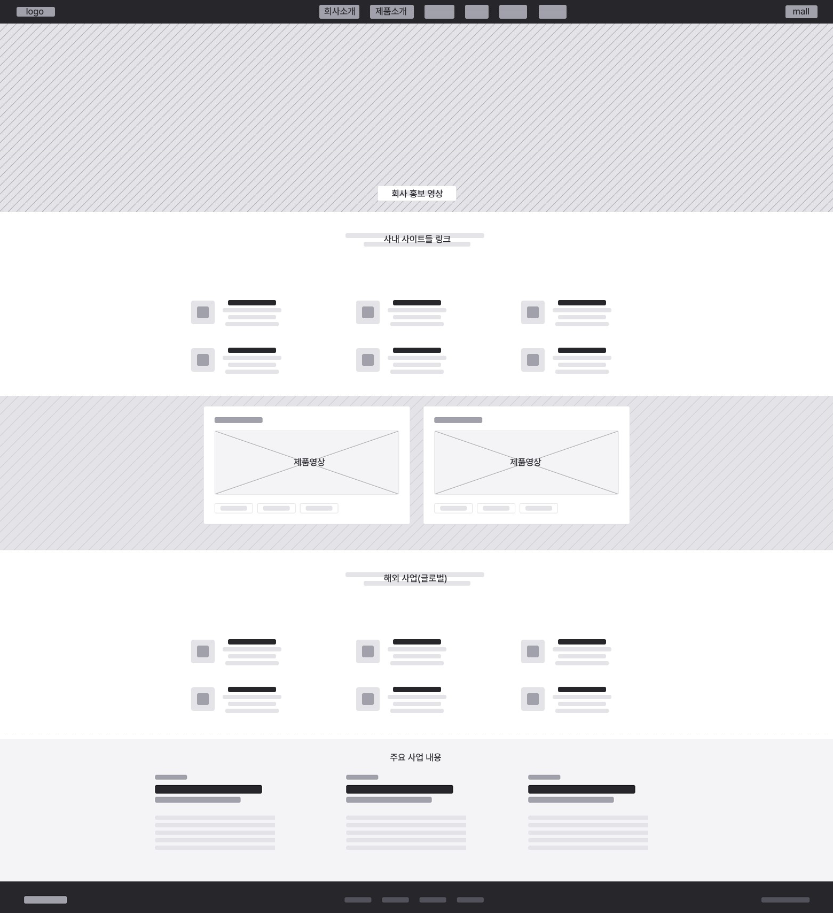
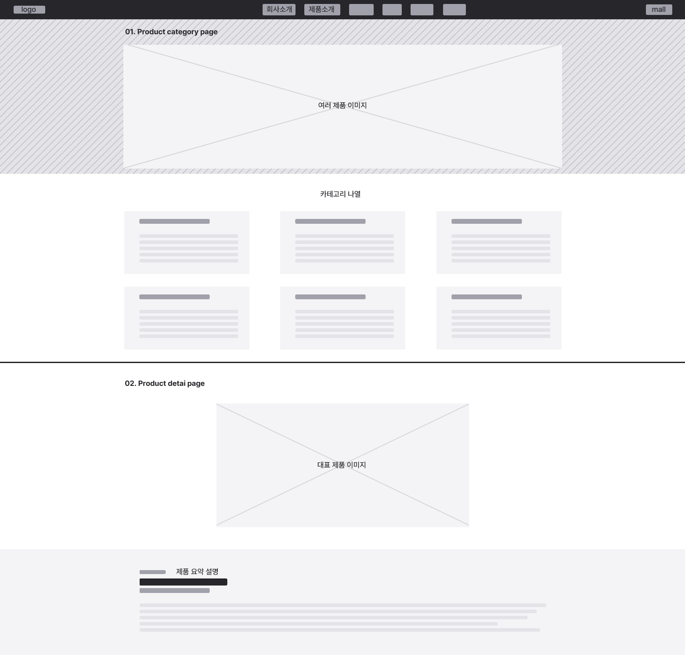

# SLI Scientific Case Study

회사소개 중심의 B2B 사이트를
제품 탐색, 기술 검토, 자료 확인과 문의 흐름 중심의
전문 제품 정보 플랫폼으로 재설계한 프로젝트입니다.

---

## 1. Project Overview

| 항목 | 내용 |
|-----|-----|
| Project | SLI Scientific |
| Type | B2B Product Information Platform Redesign |
| Role | Problem Definition, IA, UI/UX Design, Responsive UI, UI QA |
| Environment | React, React Router, Vite, CSS, GitHub, Vercel |
| Scope | Home, Products, Category, Product Detail, Resources, About, Contact |
| Status | Responsive Web / Deployed |

### My Contribution

- 프로젝트 방향과 핵심 문제 정의
- 제품 중심 정보구조와 사용자 탐색 흐름 설계
- 주요 페이지와 제품 상세 정보 구조 설계
- UI Foundation과 반응형 기준 정의
- 제품, 카테고리와 자료 콘텐츠 구조 정리
- HTML/CSS 퍼블리싱과 반응형 화면 조정
- 브라우저에서 탐색, 상태 변화와 문의 흐름 검수
- 이미지와 콘텐츠 에셋 관리
- GitHub 저장소 관리 및 Vercel 배포

---

## 2. Why This Project

현재 재직 중인 B2B 기업에서는
여러 웹사이트와 제품 관련 채널이 각각 운영되고 있어,
사이트별 역할과 제품 정보가 분산되는 문제를 반복적으로 경험했습니다.

웹사이트가 디지털 서비스보다 
회사 홍보와 카탈로그 콘텐츠를 우선하는 구조로 운영되면서,
사용자가 제품을 탐색하고 상세 정보를 검토하는 흐름이
충분히 지원되지 않는 경우가 많았습니다.

제한된 환경에서도 반응형 대응과 기본 사용성을 유지하며 실무를 수행했지만,
회사 식별 가능성과 보안 문제로 기존 작업물을 포트폴리오에 공개할 수 없었습니다.

이에 현업에서 관찰한 정보구조와 사용자 경험 문제를 비식별화하고,
회사명, 제품 콘텐츠와 시각 자산을 새롭게 구성해
가상의 브랜드 SLI Scientific 프로젝트로 재구성했습니다.

앞선 Minimal Ecommerce의 반응형 UI 경험과
Frame Design System의 토큰·컴포넌트 원칙을
실무형 B2B 문제에 확장해 적용했습니다.

---

## 3. Background & Problem

실무에서 제품 관련 문의와 웹 콘텐츠를 운영하며 관찰한 결과, 
전문 제품을 검토하는 B2B 사용자는 회사 연혁이나 홍보 문구보다 
자신의 목적과 사용 환경에 맞는 제품을 찾고, 
주요 기능과 모델별 차이, 기술 사양을 비교하는 데 더 집중했습니다.

그러나 기존 운영 환경에서는 제품 정보와 콘텐츠가
여러 사이트와 채널에 분산되어 있어
사용자가 필요한 정보를 한 흐름 안에서 검토하기 어려웠습니다.

주요 문제는 다음과 같이 정리했습니다.

- 여러 웹사이트와 채널 사이에 분산된 제품 정보
- 채널마다 다른 콘텐츠 구조
- 제품 탐색보다 회사 홍보와 카탈로그 콘텐츠가 우선되는 구성
- 다양한 제품군에 비해 부족한 검색과 탐색 경로
- 제품 상세 정보, 기술 자료와 문의 과정의 분리
- 일관되지 않은 화면과 모바일 탐색 경험
- 제품 검토를 위해 여러 페이지와 채널을 이동해야 하는 구조

### Core Problem

기존 구조는 사용자가 제품을 탐색하고 검토하는 순서보다,
기업 소개와 홍보 콘텐츠를 전달하는 순서를 우선하고 있었습니다.

따라서 제품을 사이트의 중심에 배치하고,
회사 정보는 제품 검토 과정에서 전문성과 신뢰를 보완하는 역할로
재정의할 필요가 있었습니다.

```text
기존 구조
회사 홍보 → 카탈로그형 콘텐츠 → 제한적인 제품 노출

개선 구조
제품 탐색 → 상세 검토 → 자료 확인 → 문의
                     ↓
              회사 신뢰 정보 보완
```

---

## 4. Target Users

실무에서 제품 관련 문의와 콘텐츠를 운영하며 관찰한 업무 흐름을 바탕으로,
제품 검토 과정에 관여하는 주요 사용자 유형을 다음과 같이 정의했습니다.

### Researcher / Lab Operator

사용 목적과 실험 환경에 맞는 제품을 찾고,
주요 기능과 모델별 차이, 기술 사양을 비교하는 사용자입니다.

주요 요구:

- 사용 목적에 맞는 제품군 탐색
- 주요 기능과 적용 분야 확인
- 모델별 차이와 기술 사양 비교
- 관련 카탈로그와 기술 자료 확인
- 제품 관련 기술 문의

### Shared User Need

업무 목적에는 차이가 있지만,
두 사용자 유형 모두 제품 후보를 좁히고 필요한 정보를 검토한 뒤
문의로 이어지는 공통 흐름을 가집니다.

```text
적합한 제품군 탐색
        ↓
주요 기능과 적용 분야 확인
        ↓
모델별 차이와 기술 사양 비교
        ↓
관련 자료 확인
        ↓
제품 또는 견적 문의
```

이에 따라 사이트의 정보구조도 기업이 먼저 전달하고 싶은 콘텐츠보다
사용자가 제품을 검토하는 순서를 중심으로 설계했습니다.

---

## 5. Information Architecture

기존 구조에서는 회사소개, 홍보 콘텐츠와 제품 정보의 역할이 명확히 구분되지 않아,
사용자가 제품 탐색부터 상세 검토와 문의까지 하나의 흐름으로 이어가기 어려웠습니다.

이를 개선하기 위해 제품 탐색을 중심으로
각 콘텐츠와 페이지의 역할을 다시 정의했습니다.

### Before: Fragmented Structure

#### Main



#### Products



- 실제 사이트를 재현한 화면이 아니라,
  관찰한 구조적 문제만 추상화한 비식별화 와이어프레임입니다.

```text
Corporate Site
├─ Company Introduction
├─ History
├─ Technology
├─ Promotional Content
└─ Limited Product Information

Product Channel
├─ Product List
├─ Product-focused Content
└─ Separate Inquiry

Additional Channels
├─ Company Information
├─ Different Product Categories
└─ Inconsistent Content Structure
```

채널마다 역할과 정보 구조가 달라,
사용자는 하나의 제품을 검토하기 위해 여러 페이지와 채널을 이동해야 했습니다.

### After: Product-Centered Platform

```text
Home
├─ Product Categories
├─ Featured Products
├─ Product Discovery Guide
├─ Support Services
├─ Resources
├─ Company Trust
└─ Inquiry CTA

Products
├─ Search
├─ Category Filter
├─ Product List
└─ Product Card

Category
├─ Category Overview
├─ Subcategories
└─ Related Products

Product Detail
├─ Product Gallery
├─ Product Summary
├─ Model Selection
├─ Key Features
├─ Applications
├─ Technical Specifications
├─ Resources
└─ Inquiry

Resources
├─ Catalogs
├─ Technical Documents
└─ Resource Information

About
├─ Company Overview
├─ Operating Approach
└─ Support Scope

Contact
├─ Product Inquiry
├─ Technical Inquiry
├─ Resource Request
└─ General Inquiry
```

### IA Principle

정보구조는 다음 원칙을 기준으로 설계했습니다.

- 제품군을 주요 탐색 기준으로 배치
- 검색과 카테고리 탐색을 함께 제공
- 제품 상세 안에서 주요 기능, 모델, 사양과 자료를 연결
- 제품 검토에서 문의까지 하나의 흐름으로 구성
- 회사 정보는 제품 검토에 필요한 신뢰 정보를 보완하는 역할로 배치
- 자료실은 독립적인 홍보 영역이 아니라 제품 검토를 지원하는 콘텐츠로 정의

### Primary User Flow

```text
Home
  ↓
Product Category or Search
  ↓
Product List
  ↓
Product Detail
  ↓
Model and Specification Review
  ↓
Resource Check or Inquiry
```

사용자가 회사소개 페이지를 먼저 거치지 않아도
제품을 탐색하고 필요한 정보를 검토한 뒤
자료 확인이나 문의로 이어질 수 있도록 구성했습니다.

---

## 6. Product Discovery Strategy

기존 구조의 가장 큰 문제는 제품 정보가 존재하더라도
사용자가 원하는 제품까지 도달하는 과정이 명확하지 않다는 점이었습니다.

SLI Scientific에서는 제품 탐색을 하나의 경로에만 의존하지 않고,
사용자가 현재 알고 있는 정보의 수준에 따라
여러 방식으로 탐색을 시작할 수 있도록 구성했습니다.

### Discovery Entry Points

- Home의 제품 카테고리
- 대표 제품 영역
- 제품 선택 가이드
- Products 페이지의 검색
- 카테고리 필터
- Category 페이지의 하위 제품군
- 제품 카드를 통한 상세 페이지 진입

제품명을 알고 있는 사용자는 검색으로 바로 접근하고,
제품군만 알고 있는 사용자는 카테고리를 따라 탐색할 수 있도록 했습니다.

필요한 제품이 명확하지 않은 사용자는
제품 선택 가이드에서 탐색을 시작할 수 있도록 구성했습니다.

### Search and Filter

Products 페이지에서는 검색과 카테고리 필터를 함께 사용해
제품 후보를 단계적으로 좁힐 수 있도록 구성했습니다.

검색어는 제품명, 모델명과 제품 설명에 반영되며,
카테고리 필터를 함께 사용해 결과 범위를 줄일 수 있습니다.

```text
전체 제품
   ↓
검색 또는 카테고리 선택
   ↓
조건에 맞는 제품 확인
   ↓
제품 카드 검토
   ↓
제품 상세 진입
```

검색과 필터를 독립적인 기능으로 강조하기보다,
사용자가 많은 제품 가운데 검토할 후보를 빠르게 좁히는
기본 탐색 도구로 설계했습니다.


## Product Card

현재 내용은 사용자 관점으로 잘 작성되어 있습니다. 다음 정도로만 다듬으면 됩니다.


### Product Card

제품 카드는 사용자가 목록 단계에서
상세 페이지를 확인할지 판단하는 데 필요한 정보를 우선적으로 보여줍니다.

- 제품 이미지
- 제품명
- 모델명
- 카테고리
- 핵심 설명
- 상세 페이지 링크

카드에 모든 정보를 담기보다,
제품을 구분하고 다음 탐색 여부를 판단하는 데 필요한 내용만 제공했습니다.

### Category Page

Category 페이지는 단순한 제품 목록이 아니라, 
제품군의 구조와 하위 카테고리를 이해할 수 있는 중간 탐색 단계로 설계했습니다.

이를 통해 사용자는 전체 제품 목록에서 바로 개별 제품을 찾는 대신,
제품군의 특성을 먼저 이해하고 관련 제품을 좁혀갈 수 있습니다.

### Product Discovery Principle

제품 탐색 과정은 사용자가 현재 알고 있는 정보의 수준에 따라
다음 세 가지 방식으로 시작할 수 있도록 구성했습니다.

- 제품명을 알고 있음 → Search
- 제품군을 알고 있음 → Category
- 필요한 제품이 명확하지 않음 → Product Discovery Guide

하나의 탐색 방식만 요구하지 않고,
사용자가 가진 정보에 맞는 경로를 선택할 수 있도록 했습니다.

---

## 7. Representative Product Detail

여러 제품에 공통으로 적용할 상세 페이지 구조를 설계하고,
생물안전작업대를 대표 사례로 선정해
제품 검토에 필요한 정보와 인터랙션을 구체화했습니다.

대표 상세 페이지는 제품을 소개하는 데 그치지 않고,
사용자가 주요 기능과 모델, 기술 사양을 단계적으로 검토한 뒤
자료 확인이나 문의로 이어질 수 있도록 구성했습니다.

### Detail Information Structure

```text
Product Gallery
        ↓
Product Summary
        ↓
Model Selection
        ↓
Key Features
        ↓
Applications
        ↓
Technical Specifications
        ↓
Resources
        ↓
Product Inquiry
```

### Product Gallery

제품의 외형과 주요 구조를 여러 방향에서 확인할 수 있도록
대표 이미지와 썸네일 갤러리를 구성했습니다.

썸네일을 선택하면 해당 이미지가 크게 표시되어,
사용자가 제품의 세부 형태를 순서대로 살펴볼 수 있도록 했습니다.

### Model Selection

동일한 제품군 안에서도 크기와 사양에 따라 여러 모델이 제공되는 상황을 고려해,
모델 선택 영역을 상세 페이지 상단에 배치했습니다.

선택한 모델이 화면에 명확하게 표시되도록 해,
사용자가 현재 어떤 조건의 제품을 검토하고 있는지
쉽게 확인할 수 있도록 했습니다.

### Key Features

제품의 주요 기능을 긴 설명문보다 빠르게 파악할 수 있도록
이미지와 짧은 설명을 함께 구성했습니다.

기능을 단순히 나열하기보다,
각 기능이 어떤 사용 환경과 연결되는지 설명하여
사용자가 자신의 목적에 맞는지 검토할 수 있도록 했습니다.

### Applications

제품이 활용될 수 있는 주요 환경과 목적을 별도의 영역으로 구성했습니다.

기술 사양을 먼저 보여주기보다 사용자가 제품의 활용 맥락을 이해한 뒤
구체적인 조건을 검토할 수 있도록 정보 순서를 조정했습니다.

### Technical Specifications

모델별 조건과 주요 수치를 비교하기 쉽도록 기술 사양을 표 형태로 구성했습니다.

제품 소개와 기술 정보를 구분해,
사용자가 자신의 목적에 필요한 정보로 빠르게 이동할 수 있도록 했습니다.

### Resources

브로셔와 기술 자료를 제품 상세 안에서 함께 확인할 수 있도록
관련 자료 영역을 연결했습니다.

사용자가 별도의 자료실로 이동해 같은 제품을 다시 찾지 않아도 되도록,
제품 정보와 관련 자료를 한 흐름 안에 배치했습니다.

### Inquiry Flow

제품 상세에서 문의 페이지로 이동할 때 검토하던 
제품명, 카테고리와 모델 정보가 문의 화면에 이어지도록 구성했습니다.

```text
Product Detail
   ↓
Selected Product / Model
   ↓
Contact Form
   ↓
Pre-filled Inquiry Information
```

사용자가 이미 확인한 제품 정보를 다시 입력하지 않아도 되도록 해,
제품 검토와 문의가 하나의 흐름으로 이어지도록 했습니다.

### Common Detail Structure

제품마다 상세 화면의 정보 순서가 달라지지 않도록,
여러 제품에 공통으로 적용할 기본 상세 구조를 정리했습니다.

공통 구조에는 다음 정보가 포함됩니다.

- Product Summary
- Models
- Key Features
- Applications
- Technical Specifications
- Resources
- Inquiry

대표 제품에는 갤러리와 기능별 콘텐츠를 더 구체적으로 구성해,
기본 구조를 유지하면서도 제품 특성에 맞는 정보를
충분히 보여줄 수 있도록 했습니다.

이를 통해 제품이 달라져도 사용자가 동일한 순서와 방식으로
주요 정보를 검토할 수 있도록 했습니다.


---

## 8. UI Foundation & Design System Application

SLI Scientific의 UI는 프로젝트마다 새로운 기준을 만드는 대신,
Frame Design System에서 정리한 토큰과 컴포넌트 원칙을 바탕으로 구성했습니다.

다만 Frame의 기준을 그대로 옮기지 않고,
전문 제품을 다루는 B2B 플랫폼의 높은 정보 밀도와 사용 맥락에 맞게
컬러, 타이포그래피, 간격과 UI 기준을 조정했습니다.

### Design Direction

SLI Scientific의 시각 방향은 다음 세 가지 키워드로 정의했습니다.

```text
Calm
Professional
Information-focused
```

제품과 기술 정보가 화면의 중심이 되도록 불필요한 장식은 줄이고,
Deep Blue, Slate와 Muted Cyan을 중심으로
차분하고 전문적인 인상을 구성했습니다.

브랜드 색상이 제품 정보를 압도하지 않도록 사용 범위를 제한하고,
카테고리, 주요 기능, 기술 사양과 문의가
명확하게 구분되도록 정보 위계를 정리했습니다.

### UI Foundation

- Color
- Typography
- Spacing
- Layout
- Border Radius
- Shadow
- Responsive Breakpoints

### Shared UI Principles

- Button
- Card
- Form Field
- Section Heading
- Container


### Frame DS to SLI Scientific

Frame Design System의 기본 원칙을
SLI Scientific의 콘텐츠 특성과 사용 맥락에 맞게 다음과 같이 조정했습니다.

| Frame Design System | SLI Scientific 적용 |
|-----|-----|
| Color tokens | Deep Blue, Slate, Muted Cyan을 활용한 컬러 체계 |
| Typography scale | 제품명, 섹션 제목, 설명과 사양 정보의 위계 |
| Spacing tokens | 섹션, 카드와 콘텐츠 그룹 사이의 공통 간격 |
| Button variants | 주요 행동, 보조 행동과 텍스트 링크의 구분 |
| Card principles | Product, Resource와 Support 카드의 공통 기준 |
| Container rules | 페이지별 콘텐츠 폭과 정렬 기준 |
| Responsive rules | Desktop, Tablet과 Mobile 레이아웃 전환 |
| Component states | Hover, Focus, Selected와 Disabled 상태 표현 |

### Design-to-UI Application

Figma에서 정리한 UI 기준이
브라우저 화면에서도 같은 의미와 위계로 표현되는지 확인했습니다.

```text
Figma Foundation
        ↓
Design Tokens
        ↓
CSS Variables
        ↓
Browser UI
        ↓
Page Application
```

컬러, 간격과 레이아웃 기준은 CSS 변수와 공통 스타일에 연결되었으며,
버튼, 카드, 컨테이너와 섹션 제목이
페이지마다 일관되게 표현되는지를 중심으로 검수했습니다.

```css
:root {
  --color-primary: ...;
  --color-text: ...;
  --color-muted: ...;
  --color-border: ...;
  --space-section: ...;
  --container-width: ...;
}
```
위 코드는 구현 환경에 적용된 토큰 구조의 예시입니다.

디자인 관점에서는 각 변수의 기술적 구성보다,
색상, 간격과 콘텐츠 폭의 기준이
여러 페이지에서 같은 방식으로 유지되는지를 확인했습니다.

### Shared UI Patterns

프로젝트 전반에서 반복되는 화면 요소와 사용 방식을
다음과 같은 공통 UI 패턴으로 정리했습니다.

- Page Container
- Section Heading
- Product Card
- Resource Card
- Primary and Secondary Button
- Tag and Label
- Form Field
- Inquiry CTA
- Responsive Navigation

각 페이지는 서로 다른 목적을 가지지만,
콘텐츠 위계, 상태 표현과 주요 행동 방식은
일관된 기준을 유지하도록 구성했습니다.

### Contextual Extension

Frame Design System의 기준을 그대로 복제하지 않고,
전문 제품 콘텐츠의 특성에 맞게 다음 항목을 추가로 조정했습니다.

- 긴 제품명과 모델명을 수용하는 카드 구조
- 기술 사양과 자료를 읽기 위한 높은 정보 밀도
- 제품 이미지와 텍스트 정보의 균형
- 선택한 제품과 모델을 구분하는 상태 표현
- 자료 확인과 문의를 강조하는 주요 행동 구조
- 모바일에서 긴 표와 콘텐츠를 읽기 위한 레이아웃 조정

이를 통해 Frame Design System에서 정리한 기준이
독립적인 시스템 문서에 머무르지 않고,
다른 서비스 맥락의 UI에도 조정해 적용할 수 있음을 확인했습니다.


---

## 9. Responsive Design

SLI Scientific은 데스크톱 화면을 단순히 축소하지 않고,
화면 크기에 따라 콘텐츠의 우선순위와 탐색 방식을 조정했습니다.

제품 탐색, 상세 검토와 문의 흐름이
Desktop, Tablet과 Mobile에서도 자연스럽게 이어지도록
레이아웃과 정보 배치를 재구성했습니다.

```text
Desktop
1025px 이상

Tablet
1024px 이하

Mobile
768px 이하
```

### Responsive Priorities

화면이 좁아질수록 장식적 요소보다
제품 탐색과 정보 검토에 필요한 콘텐츠가 먼저 보이도록 구성했습니다.

- 다단 레이아웃을 단일 열로 전환
- 화면 너비에 맞춰 제품 카드 배열 조정
- 긴 제품명과 모델명이 안정적으로 표시되도록 텍스트 영역 조정
- 기술 사양과 상세 콘텐츠의 모바일 읽기 방식 조정
- 데스크톱 내비게이션을 모바일 메뉴로 전환
- 문의 버튼과 주요 행동 영역을 쉽게 찾을 수 있도록 배치
- 이미지와 텍스트 순서를 콘텐츠 중요도에 따라 재구성

### Home

데스크톱에서는 제품 카테고리, 대표 제품과 지원 콘텐츠를
구획별로 나누어 한 화면에서 전체 구성을 파악할 수 있도록 했습니다.

모바일에서는 각 섹션을 세로 흐름으로 연결하고,
사용자가 제품 탐색을 먼저 시작할 수 있도록
Hero, Product Categories와 Featured Products의 우선순위를 유지했습니다.

### Product Discovery

Products 페이지에서는 검색과 카테고리 필터를
제품 목록보다 먼저 확인할 수 있도록 배치했습니다.

화면 폭이 줄어들면 탐색 조건과 제품 그리드의 배치를 조정해,
모바일에서도 현재 검색어와 선택한 카테고리를 확인한 뒤
제품 목록을 탐색할 수 있도록 했습니다.

### Product Detail

제품 상세는 정보량이 가장 많은 화면이기 때문에 다음 순서가 모바일에서도 유지되도록 설계했습니다.

Product Image
        ↓
Product Summary
        ↓
Model Selection
        ↓
Key Features
        ↓
Applications
        ↓
Specifications
        ↓
Resources and Inquiry

데스크톱의 이미지와 제품 정보 2단 구조는 모바일에서 단일 열로 전환했습니다.

갤러리 썸네일과 모델 선택 영역은 터치 환경에서 선택 상태를 쉽게 확인할 수 있도록
크기, 간격과 배치를 조정했습니다.

적용 분야는 모바일에서 단일 열로 배치하고,
기술 사양표는 항목 간 관계를 유지하면서 좌우로 확인할 수 있는 스크롤 영역으로 구성했습니다.

### Responsive Outcome

화면 크기에 따라 레이아웃은 달라지지만,
제품을 찾고 정보를 검토한 뒤 문의로 이어지는 흐름은
일관되게 유지되도록 구성했습니다.


---

## 10. Implementation Environment & UI Validation

React 기반 화면은 AI 보조를 활용해 구성했습니다.

저는 정보구조, 사용자 흐름, 콘텐츠와 반응형 UI 기준을 정의하고,
브라우저에서 제품 탐색과 문의 흐름을 확인하며
HTML/CSS와 UI를 조정했습니다.

### Implementation Environment

- React
- React Router
- Vite
- CSS
- JavaScript
- GitHub
- Vercel

### Page & UI Structure

여러 페이지에서 동일한 탐색 방식과 시각 기준을 유지할 수 있도록
공통 레이아웃과 반복 UI가 적용된 구조를 사용했습니다.

```text
Global Layout
├─ Header
├─ Main Content
└─ Footer

Shared UI
├─ Product Card
├─ Section Heading
├─ Buttons
├─ Form Fields
└─ Inquiry CTA

Main Pages
├─ Home
├─ Products
├─ Category
├─ Product Detail
├─ Resources
├─ About
└─ Contact
```   

Header, Footer와 콘텐츠 컨테이너가
페이지마다 동일한 위치와 기준으로 표현되는지 확인했습니다.

제품 카드는 Home, Products와 Category에서
같은 정보 위계와 사용 방식이 유지되도록 검수했습니다.

### Content Structure

제품, 카테고리, 자료와 지원 콘텐츠가
각 화면에서 일관된 기준으로 표현될 수 있도록
콘텐츠 유형과 필드를 구분했습니다.

제품 콘텐츠에는 다음 항목을 공통으로 사용했습니다.

```text
Product
├─ Basic Information
├─ Category
├─ Images
├─ Models
├─ Key Features
├─ Applications
├─ Technical Specifications
└─ Resources
```

대표 제품에는 갤러리와 기능별 설명을 더 구체적으로 구성했으며,
다른 제품에서도 같은 정보 순서와 화면 기준을 유지할 수 있도록 검수했습니다.

### Page Navigation

React Router 기반 환경에서
정보구조에 따라 페이지 경로가 구분되어 있습니다.

```text
Home
/products
/products/:category
/products/:category/:product
/resources
/about
/contact
```

사용자가 제품 목록, 카테고리와 상세 페이지 사이를
예상 가능한 흐름으로 이동할 수 있는지 확인했습니다.

배포 환경에서는 상세 주소로 직접 접근하거나
페이지를 새로고침했을 때도 정상적으로 표시되는지 검수했습니다.

### Search and Filtering

Products 페이지에서는 검색어와 카테고리 조건이
제품 목록에 즉시 반영되도록 구성되어 있습니다.

다음 항목을 중심으로 검수했습니다.

- 검색어 입력에 따른 결과 변화
- 선택한 카테고리 상태 표시
- 검색과 카테고리 조건의 동시 적용
- 결과가 없을 때의 안내
- 조건 초기화 후 전체 제품 노출

### Product Detail Interaction

대표 제품 상세에서는
선택한 갤러리 이미지와 모델이 화면에 명확하게 반영되도록 구성했습니다.

```text
Thumbnail Selection
        ↓
Main Image Update

Model Selection
        ↓
Selected Model Display
```
사용자가 현재 선택한 이미지와 모델을 명확하게 확인할 수 있도록 
상태 표현을 중심으로 검수했습니다.

### Inquiry Connection

제품 상세에서 문의 페이지로 이동할 때
검토하던 제품, 카테고리와 모델 정보가
문의 화면에 이어지도록 구성했습니다.

```text
Product Detail
        ↓
Selected Product / Model
        ↓
Contact Page
        ↓
Pre-filled Inquiry Information
```
사용자가 같은 제품 정보를 다시 입력하지 않아도 되도록 해,
제품 검토와 문의가 하나의 흐름으로 이어지는지 확인했습니다.

### Accessibility Considerations

주요 화면과 인터랙션에서 다음 기본 항목을 확인했습니다.

- 링크와 버튼의 요소 구분
- 키보드 포커스 상태
- 이미지 대체 텍스트
- 모바일 메뉴의 상태 전달
- 선택 상태가 색상에만 의존하지 않는지 확인

### Browser & Deployment QA

프로젝트를 Vercel에 배포한 뒤
실제 브라우저 환경에서 다음 항목을 확인했습니다.

- 페이지별 직접 접근과 새로고침
- 데스크톱과 모바일 내비게이션
- 검색과 카테고리 필터
- 제품 상세 갤러리와 모델 선택
- 제품 정보가 이어지는 문의 흐름
- 주요 화면의 반응형 레이아웃
- 존재하지 않는 주소의 안내 화면

---

## 11. Outcome

SLI Scientific을 통해 회사소개와 홍보 콘텐츠가 중심이던 구조를
제품 탐색, 상세 검토, 자료 확인과 문의가 이어지는
제품 중심의 B2B 정보 플랫폼으로 재구성했습니다.

### Key Outcomes

- 제품 카테고리를 중심으로 한 정보구조 재편
- 검색과 카테고리를 활용한 다중 탐색 경로 구성
- 제품 목록에서 상세 검토로 이어지는 일관된 사용자 흐름
- 모델, 주요 기능, 적용 분야와 기술 사양을 단계적으로 보여주는 상세 구조
- 제품 정보와 관련 자료를 한 화면 흐름 안에 연결
- 검토 중인 제품과 모델 정보가 이어지는 문의 경험
- Frame Design System의 토큰과 UI 원칙을 프로젝트 맥락에 맞게 적용
- Desktop, Tablet과 Mobile에 대응하는 반응형 UI
- 실제 브라우저에서 주요 화면과 사용자 흐름을 확인할 수 있는 반응형 웹 완성

### Before & After

| Before | After |
|-----|-----|
| 회사소개와 홍보 콘텐츠 중심 | 제품 탐색과 검토 중심 |
| 여러 채널에 분산된 제품 정보 | 하나의 흐름으로 연결된 제품 정보 |
| 제한적인 카테고리와 검색 | 검색, 카테고리와 가이드를 활용한 탐색 |
| 제품마다 다른 정보 구성 | 공통된 상세 정보 순서 |
| 제품 검토와 문의의 분리 | 선택한 제품 정보가 이어지는 문의 |
| 화면마다 다른 UI 기준 | 공통 토큰과 UI 원칙 적용 |

---

## 12. Reflection

### What I Learned

이 프로젝트를 통해 B2B 사이트에서도
기업이 전달하고 싶은 정보보다 사용자가 제품을 찾고 검토하는 순서를
먼저 고려해야 한다는 점을 다시 확인했습니다.

특히 정보량이 많은 전문 제품일수록
제품명과 이미지를 보여주는 데 그치지 않고,
주요 기능, 모델별 차이, 적용 분야, 기술 사양과 관련 자료를
단계적으로 살펴볼 수 있는 구조가 필요했습니다.

또한 제품 상세 페이지와 문의 화면을 별개의 과정으로 다루기보다,
사용자가 검토하던 제품과 모델 정보가 문의까지 이어지도록 구성할 때
전체 사용자 흐름이 더 자연스러워진다는 점을 확인했습니다.

### Design System Application

Frame Design System에서 정리한 토큰과 컴포넌트 원칙을 SLI Scientific에 적용하면서,
디자인 시스템은 정해진 기준을 그대로 복제하는 것이 아니라
서비스의 콘텐츠와 사용 맥락에 맞게 조정해야 한다는 점을 확인했습니다.

공통된 UI 기준은 유지하면서도,
긴 제품명과 기술 정보가 각 화면에서 읽기 쉽게 표현되도록
컬러, 간격, 카드 구조와 반응형 기준을 조정했습니다.

### Implementation Experience

React 기반 화면을 브라우저에서 확인하는 과정에서
정보구조와 UI 기준이 실제 인터랙션으로 이어질 때
추가로 조정해야 하는 부분을 구체적으로 확인할 수 있었습니다.

검색 조건과 선택 상태가 명확하게 표시되는지,
제품 상세의 정보 순서가 화면 크기에 따라 흐트러지지 않는지,
검토한 제품 정보가 문의 화면까지 자연스럽게 이어지는지를 확인하며
HTML/CSS와 UI를 조정했습니다.

이를 통해 디자인 시안을 만드는 데서 끝나지 않고,
구현된 결과가 의도한 사용자 경험과 일치하는지 확인하고
필요한 수정 기준을 구체적으로 설명하는 관점을 확장했습니다.

### Challenges

가장 어려웠던 부분은 많은 정보를 제공하면서도
사용자가 제품을 검토하는 흐름을 복잡하게 만들지 않는 것이었습니다.

모든 정보를 한 화면에 동일한 비중으로 배치하면
제품의 핵심 특징과 다음 행동을 파악하기 어려울 수 있었습니다.

따라서 제품 개요, 모델, 주요 기능, 적용 분야와 기술 사양의
정보 위계를 구분하고,
상세 정보가 필요한 사용자는 단계적으로 내용을 확인할 수 있도록 구성했습니다.

또한 데스크톱의 높은 정보 밀도를 모바일에서도 그대로 유지하기보다,
콘텐츠 순서와 카드 배열, 기술 사양의 확인 방식을
작은 화면에 맞게 다시 조정했습니다.

### Limitations

본 프로젝트는 실제 서비스 출시나
사용자 인터뷰와 사용성 테스트를 거친 프로젝트가 아니라,
실무에서 관찰한 문제를 바탕으로 설계한 개인 포트폴리오 프로젝트입니다.

따라서 다음 영역은 프로젝트 범위에 포함하지 않았습니다.

- 실제 사용자 인터뷰와 사용성 테스트
- 운영 데이터와 전환 지표를 활용한 성과 측정
- 실제 제품 데이터와 문서 관리 시스템 연동
- 회원, 결제와 주문 기능
- 문의 접수 이후의 관리자 처리 과정
- 실제 조직에서의 장기 운영과 개선

대신 정보구조, 제품 탐색, 상세 검토, 자료 확인과 문의로 이어지는
핵심 사용자 흐름을 반응형 웹으로 구체화하고,
브라우저에서 주요 화면과 인터랙션을 확인하는 데 집중했습니다.

---

### Project Context

본 프로젝트는 실제 B2B 업무 환경에서 반복적으로 관찰한 정보구조와 사용자 경험 문제를 바탕으로 
재구성한 비식별화 리디자인입니다.

회사 식별 정보, 실제 제품 데이터와 기존 시각 자산은 사용하지 않았습니다.

---

## Live Demo

https://platform-redesign-five.vercel.app/